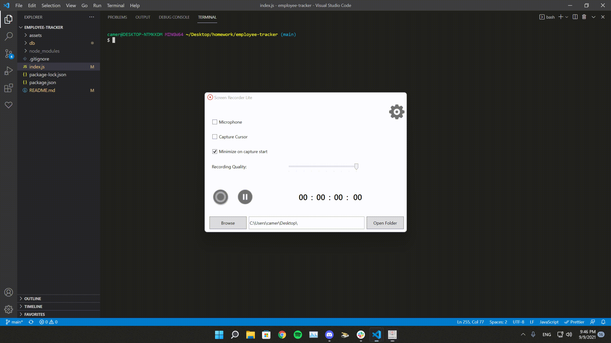

# Employee Tracker

## Description

The Employee Tracker keeps track of all employees at your company. You can view employees along with their salaries, roles, managers, and departments. You can also add employees, updated their roles, add new roles, and add new departments.

## Table of Contents

- [Installation](#installation)
- [Usage](#usage)
- [Questions](#questions)

## Installation

To install, run ```npm i``` in the terminal.

## Usage

To begin using, run ```mysql -u root -p``` in the terminal to start mySQL. Once in mySQL, run ```source db/schema.sql```. Now that the databases is loaded, you can exit mySQL and run ```npm start``` in the command prompt. Use the arrow keys to scroll up and down the list and press enter to choose an option.



## Questions

If you have any questions regarding the application that are not answered in this README, you can contact me at: 

github.com/ccardinale98

or

ccardinale98@gmail.com